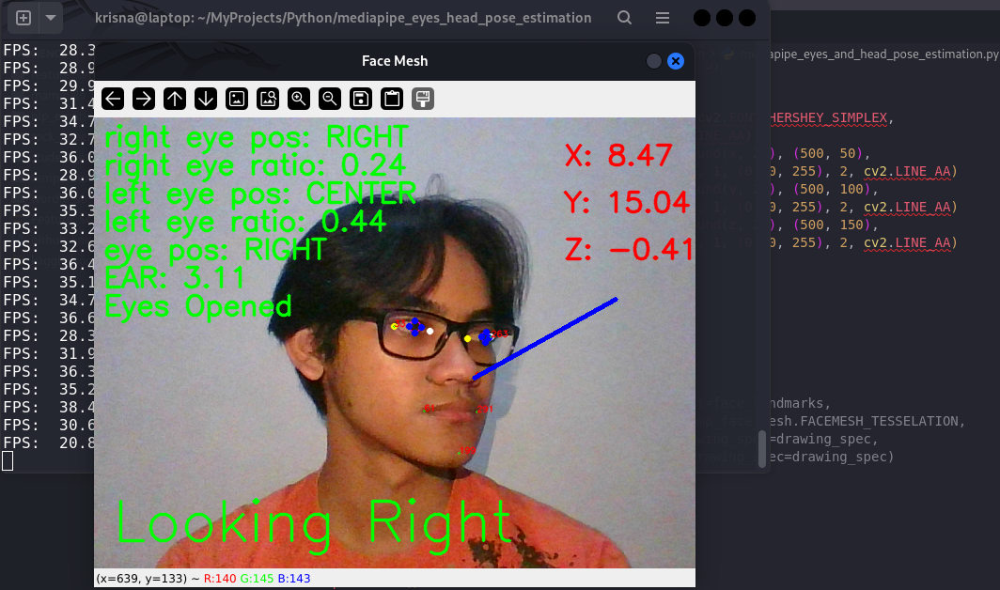
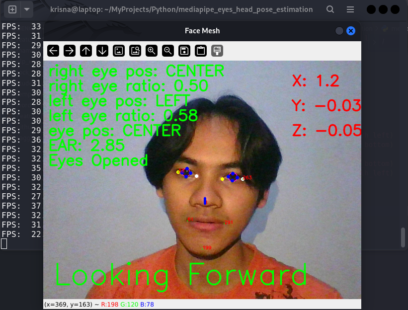
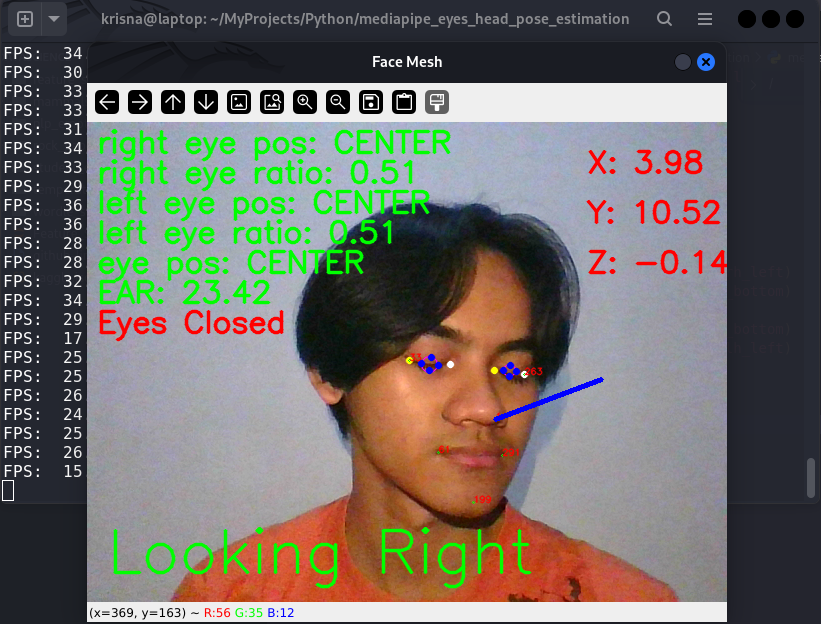

# 👁️ Head and Eye Pose Estimation



## 🚀 Project Overview

This project demonstrates real-time head and eye pose estimation using computer vision techniques. It accurately tracks the user's eye movements, blinks, and head orientation, providing valuable insights for various applications such as driver monitoring systems, attention tracking, and gaze-based interaction.

This Project inspired by these papers that I read:
- [Student Engagement Detection Using Emotion Analysis, Eye Tracking and Head Movement with Machine Learning](https://arxiv.org/abs/1909.12913)
- [Application of Deep Learning on Student Engagement in e-learning environments](https://doi.org/10.1016/j.compeleceng.2021.107277)
- [Real-time Eye Gaze Direction Classification Using Convolutional Neural Network](https://arxiv.org/pdf/1605.05258)
- [Advances in Intelligent Systems and Computing: A Review of Various State of Art Eye Gaze Estimation Techniques](https://www.springer.com/series/11156)

This project it's part of my research in the field of computer vision and machine learning. Especially in the field of eye tracking and head pose estimation. I'm trying to develop a system that can detect the student engagement in e-learning environments using the eye tracking and head movement.

## ✨ Key Features

- **Real-time Eye Tracking**: Accurately detect and track iris position
- **Blink Detection**: Measure eye aspect ratio (EAR) to identify blinks
- **Head Pose Estimation**: Calculate 3D head orientation (pitch, yaw, roll)
- **Gaze Direction**: Determine where the user is looking (left, right, center)
- **Face Mesh Visualization**: Display key facial landmarks for debugging

## 🛠️ Technologies Used

- **Python**: Core programming language
- **OpenCV**: Computer vision and image processing
- **MediaPipe**: Face mesh and landmark detection
- **NumPy**: Efficient numerical computations

## 📊 Performance

The eye tracking and head pose estimation system is designed to meet the following performance benchmarks:

- **FPS**: Consistently maintains 30+ FPS on modern hardware
- **Accuracy**: >95% accuracy in eye state detection (open/closed)
- **Latency**: <50ms end-to-end processing time

## 🚀 Getting Started

1. Clone the repository:
   ```
   git clone https://github.com/KrisnaSantosa15/head-eyes-pose-estimation.git
   ```

2. Install dependencies:
   ```
   pip install -r requirements.txt
   ```

3. Run the application:
   ```
   python mediapipe_eyes_and_head_pose_estimation.py
   ```

## 📘 How It Works

The eye tracking and head pose estimation pipeline consists of the following steps:

1. **Face Detection**: Locate the face in the input frame
2. **Landmark Extraction**: Identify 468 facial landmarks using MediaPipe
3. **Eye Region Analysis**: Calculate eye aspect ratio and detect blinks
4. **Iris Localization**: Determine the position of the iris within the eye
5. **Head Pose Calculation**: Estimate 3D head orientation using PnP algorithm


Example:



## 🤝 Contributing

Feel free to fork this repository and submit pull requests. All contributions are welcome!

## 📄 License

This project is licensed under the MIT License - see the [LICENSE](LICENSE) file for details.

## 📚 Learn More

For a detailed walkthrough of the code and methodology, check out the python script [mediapipe_eyes_and_head_pose_estimation.py](mediapipe_eyes_and_head_pose_estimation.py).

---

If you find this project interesting, don't forget to give it a star! ⭐